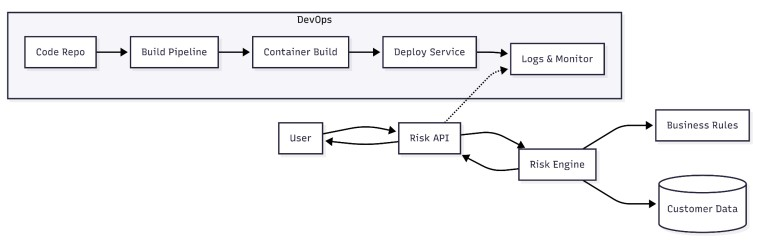

# Churn Risk Intelligence Service  
### DevOps + MLOps Architecture Assignment - 2

**Name:** B. Chamith Kalyan  
**Roll No:** 2022BCS0117  

---

## Overview

This project presents a **Churn Risk Intelligence Service** designed as a production-style system that combines:

- an **ML-driven backend** for churn prediction,
- a **DevOps workflow** for build, test, deploy, and monitor,
- and an **MLOps-oriented design** for training, versioning, evaluation, and lifecycle management.

The goal is to show how a simple prediction service can evolve from a basic API into a reliable, scalable, and observable machine learning system.

---

## Project Highlights

- REST API for churn risk prediction  
- ML-based churn classifier for live inference  
- Clean DevOps delivery pipeline  
- Container-based deployment  
- Automated testing  
- Metrics collection and monitoring  
- DVC-ready training pipeline and model artifact tracking  
- Experiment log, model registry metadata, and scheduled retraining hooks  

---

## Architecture at a Glance

| Layer | What It Does |
|------|--------------|
| Application Layer | Receives user requests and returns churn risk |
| Decision Layer | Applies a trained churn model to estimate risk |
| DevOps Layer | Builds, tests, packages, and deploys the service |
| Observability Layer | Tracks API health, latency, and usage |
| MLOps Layer | Supports training, evaluation, and model lifecycle |

---

## 1. DevOps Architecture

  

---

## 2. ML-Ready Architecture

  

---

## 3. MLOps Production Architecture

  

---

## API Endpoints

### Base URL

http://localhost:8000

### Available Routes

| Endpoint        | Method | Purpose                       |
|----------------|--------|------------------------------|
| /              | GET    | Health check                 |
| /predict-risk  | POST   | Predict churn risk with the saved model |
| /model-info    | GET    | View training metrics and artifact path |
| /monitoring-summary | GET | View simple feature-drift and retraining signals |
| /metrics       | GET    | Expose Prometheus metrics    |
| /docs          | GET    | Interactive API documentation|

---

---

## Setup Instructions

### 1. Clone the repository

git clone <your-repository-link>  
cd <project-folder>

### 2. Install dependencies

pip install -r requirements.txt

### 3. Run the API

python scripts/train_model.py
uvicorn src.app:app --host 0.0.0.0 --port 8000

---

## Docker Execution

### Build the image

docker build -t churn-risk-service .

### Run the container

docker run -p 8000:8000 churn-risk-service

---

---

## Testing

Run the test suite with:

pytest

### Test Coverage Includes

- API response validation  
- training/inference schema checks  
- model prediction flow checks  

---

## Technologies Used

| Category       | Tools           |
|----------------|----------------|
| Backend        | FastAPI        |
| Language       | Python         |
| ML             | scikit-learn   |
| Data Pipelines | pandas, DVC    |
| Containers     | Docker         |
| CI/CD/CT       | GitHub Actions |
| Testing        | Pytest         |

---

## MLOps Additions

- Reproducible feature engineering in `src/pipeline/training_pipeline.py`
- Serialized sklearn preprocessing + classifier artifact in `models/churn_model.joblib`
- Training metrics in `artifacts/metrics/training_metrics.json`
- Experiment tracking log in `artifacts/experiments/experiments.jsonl`
- Model registry metadata in `artifacts/model_registry/registry.json`
- DVC stage definition in `dvc.yaml`
- Scheduled CI workflow for retraining and monitoring

---

## 🧠 MLOps Flow (DVC + MLflow)

1. Data is versioned using DVC  
2. Feature engineering pipeline ensures consistency  
3. Model is trained on versioned datasets  
4. Experiments are tracked using MLflow  
5. Best model is registered and promoted  
6. Model is deployed via FastAPI API  
7. Monitoring tracks performance and drift  
8. CI/CD triggers retraining (Continuous Training)

---

## Key Learnings

- ML systems require more than deployment  
- Data quality is as important as code quality  
- Monitoring must continue after release  
- MLOps helps make ML services reliable in production  

---

## Conclusion

This project demonstrates the progression from a simple rule-based service to a production-aware ML system.  
It shows how DevOps supports delivery, while MLOps ensures model reliability, traceability, and long-term performance.

---

## Acknowledgement

Prepared by  
B. Chamith Kalyan  
2022BCS0117
